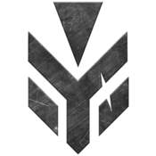

# Strykers Front-End

Sistema de gerenciamento completo para a organização militar Strykers no universo de Star Citizen. Uma aplicação SPA (Single Page Application) desenvolvida com Vanilla JavaScript, Vite e TailwindCSS.



## 📋 Índice

- [Sobre o Projeto](#sobre-o-projeto)
- [Funcionalidades](#funcionalidades)
- [Tecnologias](#tecnologias)
- [Instalação](#instalação)
- [Estrutura do Projeto](#estrutura-do-projeto)
- [Documentação Detalhada](#documentação-detalhada)
- [Configuração](#configuração)
- [Contribuindo](#contribuindo)

## 🎯 Sobre o Projeto

O Strykers Front-End é uma plataforma web completa para gerenciar todos os aspectos de uma organização militar no Star Citizen. O sistema permite controle de membros, eventos, treinamentos, condecorações e muito mais, com uma interface moderna e intuitiva.

### Características Principais

- ✨ Interface moderna com tema espacial/militar
- 🔐 Sistema completo de autenticação e autorização
- 👥 Sistema de roles e permissões (USER, ADMIN, SUPER_ADMIN)
- 👤 Gerenciamento avançado de membros e patentes
- 📅 Sistema de eventos com calendário interativo
- 🏅 Sistema de condecorações e medalhas
- 📊 Estatísticas e histórico detalhado
- 🎖️ Gerenciamento de Forças Especiais (S.T.O.R.M. e G.H.O.S.T.)
- 📱 Design responsivo para todos os dispositivos

## 🚀 Funcionalidades

### 1. Sistema de Autenticação

- Cadastro de novos usuários com confirmação de e-mail
- Login seguro com validação
- Sistema de aprovação de alistamentos
- **Três níveis de acesso:**
  - 👤 **USER**: Acesso básico (visualização e perfil próprio)
  - ⚜️ **ADMIN**: Gerenciamento operacional (membros, eventos, aprovações)
  - 👑 **SUPER_ADMIN**: Controle total (incluindo gerenciamento de roles)
- Proteção de rotas baseada em permissões
- Badges visuais de identificação de role
- Gerenciamento de perfil pessoal

### 2. Gerenciamento de Membros

- Listagem completa com filtros avançados
- Perfis detalhados com foto e informações
- Histórico de missões participadas
- Sistema de patentes (16 níveis)
- Atribuições (Infantaria, Força Aérea, Marinha)
- Status (Ativo, Reservista, Desertor)
- Forças Especiais (S.T.O.R.M., G.H.O.S.T.)

### 3. Sistema de Eventos

- Calendário interativo mensal
- Categorias de eventos:
  - Treinamento
  - Missão
  - Operação
  - Mega Operação
  - Campanha
  - Outro
- Gerenciamento de participantes
- Finalização de eventos com contabilização automática
- Card de próximo evento na página principal

### 4. Sistema de Condecorações

- 6 tipos de medalhas disponíveis:
  - Medalha de Mérito Operacional
  - Medalha de Defesa Avançada
  - Medalha de Elite Aérea
  - Medalha de Infantaria Pesada
  - Insígnia da Águia Dourada
  - Distintivo de Honra Logística
- Histórico completo de condecorações
- Observações personalizadas por medalha

### 5. Painel Administrativo

- Aprovação/recusa de alistamentos
- Gerenciamento completo de membros
- Condecoração de membros
- Criação e gerenciamento de eventos
- Edição de informações
- Sistema de histórico para missões antigas

### 6. Carrossel de Imagens

- Suporte para até 50 imagens
- Exibição de 3 imagens por vez
- Navegação automática (5 segundos)
- Indicadores de slide
- Formatos aceitos: JPG, JPEG, PNG

## 🛠️ Tecnologias

- **Vite** - Build tool e dev server
- **TailwindCSS v4** - Framework CSS utility-first
- **Vanilla JavaScript** - JavaScript puro, sem frameworks
- **LocalStorage** - Persistência de dados no navegador
- **Google Fonts (Orbitron)** - Tipografia futurista

## 📦 Instalação

### Pré-requisitos

- Node.js (versão 18 ou superior)
- npm ou yarn

### Passos

1. Clone o repositório:

```bash
git clone [URL_DO_REPOSITORIO]
cd strykersFrontEnd
```

2. Instale as dependências:

```bash
npm install
```

3. Inicie o servidor de desenvolvimento:

```bash
npm run dev
```

4. Acesse no navegador:

```
http://localhost:5173
```

### Build para produção

```bash
npm run build
```

Os arquivos otimizados estarão na pasta `dist/`.

## 📁 Estrutura do Projeto

```
strykersFrontEnd/
├── public/
│   ├── STRYKERS-Logo.png          # Logo principal
│   ├── logoSTORM.png               # Logo da S.T.O.R.M.
│   ├── logoGHOST.png               # Logo da G.H.O.S.T.
│   ├── imgCarrossel/               # Imagens do carrossel (até 50)
│   └── imgMedalhas/                # Imagens das medalhas (6 tipos)
├── src/
│   ├── components/
│   │   ├── calendario.js           # Componente do calendário
│   │   └── membros-utils.js        # Funções auxiliares de membros
│   ├── pages/
│   │   ├── home.js                 # Página inicial
│   │   ├── membros.js              # Página de membros
│   │   ├── eventos.js              # Página de eventos
│   │   ├── forcasespeciais.js      # Página de forças especiais
│   │   ├── perfil.js               # Página de perfil do usuário
│   │   └── administracao.js        # Painel administrativo
│   ├── auth.js                     # Sistema de autenticação
│   ├── carousel.js                 # Lógica do carrossel
│   ├── eventos.js                  # Lógica de eventos
│   ├── membros.js                  # Lógica de membros
│   ├── router.js                   # Sistema de roteamento SPA
│   ├── main.js                     # Ponto de entrada
│   └── style.css                   # Estilos customizados
├── index.html                      # HTML principal
├── package.json                    # Dependências do projeto
├── vite.config.js                  # Configuração do Vite
└── README.md                       # Este arquivo
```

## 📚 Documentação Detalhada

Para informações mais específicas, consulte os documentos na pasta `docs/`:

- **[ROLES.md](docs/ROLES.md)** - Sistema de roles e permissões
- **[CAROUSEL.md](docs/CAROUSEL.md)** - Como usar e configurar o carrossel de imagens
- **[EVENTS.md](docs/EVENTS.md)** - Sistema de eventos e calendário
- **[MEMBERS.md](docs/MEMBERS.md)** - Gerenciamento de membros e patentes
- **[MEDALS.md](docs/MEDALS.md)** - Sistema de condecorações
- **[AUTH.md](docs/AUTH.md)** - Sistema de autenticação
- **[ADMIN.md](docs/ADMIN.md)** - Painel administrativo
- **[CONSTANTS.md](docs/CONSTANTS.md)** - Como modificar constantes do projeto

## ⚙️ Configuração

### Criar Super Admin Inicial

Para criar o primeiro super administrador do sistema:

1.  Abra o console do navegador (F12)
2.  Execute o seguinte código:

`

javascript

`const usuarios =  JSON.parse(localStorage.getItem('strykers_usuarios')  ||  '[]');  usuarios.push({  id:  'user-superadmin-'  +  Date.now(),  nome:  'Super Admin',  email:  'admin@strykers.com',  senha:  'admin123',  role:  'super_admin',  status:  'aprovado',  emailConfirmado:  true,  dataSolicitacao:  new  Date().toISOString(),  });  localStorage.setItem('strykers_usuarios',  JSON.stringify(usuarios));  console.log('✅ Super Admin criado!');`

`

1.  Faça login com:
    - Email: `admin@strykers.com`
    - Senha: `admin123`

⚠️ **IMPORTANTE**: Altere a senha imediatamente após o primeiro login!

### Carrossel de Imagens

1. Renomeie suas imagens seguindo um dos padrões:

   - `image1.jpg`, `image2.jpg`, ...
   - `img1.jpg`, `img2.jpg`, ...
   - `1.jpg`, `2.jpg`, ...

2. Coloque as imagens na pasta `public/imgCarrossel/`

3. O carrossel aceita até 50 imagens

4. Formatos suportados: JPG, JPEG, PNG

### Medalhas

As imagens das medalhas devem estar em `public/imgMedalhas/` com os seguintes nomes:

- `medalha_merito_operacional.png`
- `medalha_defesa_avancada.png`
- `medalha_elite_aerea.png`
- `medalha_infantaria_pesada.png`
- `medalha_insignia_aguia_dourada.png`
- `medalha_distintivo_honra_logistica.png`

### LocalStorage

O sistema utiliza LocalStorage para persistência de dados. As seguintes chaves são utilizadas:

- `strykers_membros` - Dados dos membros
- `strykers_eventos` - Eventos cadastrados
- `strykers_usuarios` - Usuários do sistema
- `strykers_user_session` - Sessão do usuário logado
- `strykers_alistamentos_pendentes` - Alistamentos aguardando aprovação
- `strykers_alistamentos_recusados` - Alistamentos recusados

## 🎨 Customização

### Cores e Tema

O projeto utiliza TailwindCSS. As cores principais são:

- **Primária**: Cyan (#22d3ee)
- **Background**: Slate (tons escuros)
- **Texto**: Branco e cinza claro

Para modificar o tema, edite as classes Tailwind nos arquivos de páginas.

### Adicionar Novas Patentes

Edite os selects de patente nos arquivos:

- `src/pages/membros.js`
- `src/pages/administracao.js`

### Adicionar Novas Categorias de Eventos

Edite o objeto `CATEGORIAS_CORES` em:

- `src/eventos.js`
- `src/components/calendario.js`

## 🤝 Contribuindo

1. Faça um Fork do projeto
2. Crie uma branch para sua feature (`git checkout -b feature/AmazingFeature`)
3. Commit suas mudanças (`git commit -m 'Add some AmazingFeature'`)
4. Push para a branch (`git push origin feature/AmazingFeature`)
5. Abra um Pull Request

## 📝 Notas Importantes

### ⚠️ Limitações do LocalStorage

- O LocalStorage tem limite de ~5-10MB dependendo do navegador
- Não é adequado para produção em larga escala
- Para produção, considere implementar um backend com banco de dados

### 🔒 Segurança

- As senhas são armazenadas em texto simples no LocalStorage
- **NÃO USE EM PRODUÇÃO** sem implementar hash de senhas e backend seguro
- Este é um projeto educacional/demonstrativo

### 📱 Compatibilidade

- Testado nos navegadores modernos (Chrome, Firefox, Edge, Safari)
- Requer JavaScript habilitado
- Design responsivo para mobile, tablet e desktop

## 📄 Licença

Este projeto é privado e destinado ao uso exclusivo da organização Strykers.

## 👥 Autores

### 🧑‍💻 Desenvolvedor Principal (Front-end)

- **Willian Luigi Carneri** - Responsável pela arquitetura e desenvolvimento da interface do usuário (UI).[https://github.com/willcarneri]

### 🏗️ Desenvolvimento e Manutenção

- **Equipe Strykers** - Desenvolvimento e manutenção contínua

## 📞 Suporte

Para dúvidas ou problemas:

- Abra uma issue no repositório
- Entre em contato via Discord da organização

---

**Disciplina. Ordem. Supremacia.**

_Lema dos Strykers_
